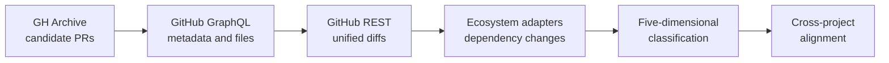

# deptracker

`deptracker` is a Python research pipeline for mining dependency-update pull
requests and studying how projects respond to the same upstream version change.
It discovers candidate pull requests in GH Archive, enriches them through
GitHub, extracts package updates from manifest diffs, classifies each change,
and computes cross-project alignment statistics.

This repository is part of the 2026
[Research Project](https://github.com/TU-Delft-CSE/Research-Project) of
[TU Delft](https://github.com/TU-Delft-CSE).

## Pipeline



1. **Discover** queries one exact GH Archive daily table in BigQuery and stores
   candidate `PullRequestEvent` rows.
2. **Enrich** batches GitHub GraphQL requests, paginates changed files, stores
   PR metadata, and applies a strict manifest-only filter.
3. **Parse** downloads unified diffs and delegates manifest changes to
   ecosystem-specific adapters.
4. **Classify** labels source, semver tier, security signal,
   direct/transitive status, and outcome.
5. **Align** aggregates shared `(package, from_version, to_version)` triples and
   measures agreement in project decisions using normalized Shannon entropy.

The pipeline uses an idempotent SQLite schema and is resumable after API,
network, or rate-limit interruptions.

## Ecosystem Coverage

| Ecosystem | Parsed manifests | Parsed lockfiles | Explicit limitations |
|---|---|---|---|
| Maven | `pom.xml`, `build.gradle`, `build.gradle.kts` | None | Gradle variables and version catalogs are unsupported |
| npm | `package.json` | `package-lock.json` | `yarn.lock` and `pnpm-lock.yaml` are recognized but not parsed |
| Cargo | `Cargo.toml` | `Cargo.lock` | Complex workspace inheritance may require additional handling |
| pip | `requirements*.txt`, `pyproject.toml`, `Pipfile` | `Pipfile.lock`, `poetry.lock` | Dynamic dependency declarations are outside the parser's scope |
| Go | `go.mod` | None | `go.sum` is recognized but intentionally not treated as a decision manifest |

Nested repository paths are supported, including
`frontend/package.json`, `services/api/requirements-dev.txt`, and
`backend/go.mod`.

## Installation

Python 3.12 is required.

```bash
git clone <repository-url>
cd deptracker
python -m venv .venv
```

Activate the environment:

```bash
# Linux/macOS
source .venv/bin/activate

# Windows PowerShell
.\.venv\Scripts\Activate.ps1
```

Install the project and development tools:

```bash
python -m pip install -e ".[dev]"
```

Copy `.env.example` to `.env`, then provide:

```dotenv
GITHUB_TOKEN=ghp_xxx
GCP_PROJECT_ID=your-project-id
```

`GCP_PROJECT_ID` is needed only for discovery. `GITHUB_TOKEN` is needed for
GitHub enrichment and increases the REST allowance used during parsing.
All unit tests run offline and require neither credential.

## Quick Start

The following bounded run exercises the full pipeline:

```bash
deptracker init
deptracker discover --date 20260506 --limit 1000
deptracker enrich --max-prs 50
deptracker parse --max-prs 50
deptracker classify
deptracker compute-alignment
deptracker stats
```

> **Paper sample:** To reproduce the GH Archive discovery sample reported in
> the paper, run `deptracker discover --date YYYYMMDD` once for each of these
> 19 daily table suffixes:
> `20260112`, `20260120`, `20260128`, `20260205`, `20260213`, `20260223`,
> `20260303`, `20260311`, `20260319`, `20260327`, `20260407`, `20260415`,
> `20260423`, `20260429`, `20260430`, `20260504`, `20260505`, `20260506`,
> and `20260507`.

The default database is `data/deptracker.sqlite`. The `data/` directory is
ignored by Git because it can contain large derived datasets and locally cached
public GitHub text.

## CLI Reference

| Command | Purpose | Network |
|---|---|---|
| `deptracker init` | Initialize or migrate the SQLite schema | No |
| `deptracker discover --date YYYYMMDD` | Discover candidate PR events | BigQuery |
| `deptracker enrich` | Fetch PR metadata and changed-file lists | GitHub GraphQL |
| `deptracker parse` | Fetch and parse unified PR diffs | GitHub REST |
| `deptracker classify` | Compute five heuristic labels | No |
| `deptracker fetch-closing-comments` | Cache bot closing comments for conservative supersession detection | GitHub GraphQL |
| `deptracker compute-alignment` | Rebuild the shared-triple alignment table | No |
| `deptracker diagnose` | Write pipeline diagnostics to JSON | No |
| `deptracker sq1-effects` | Compute SQ1 Cramer's V effect sizes | No |
| `deptracker sq2-strata` | Compute stratified SQ2 summaries | No |
| `deptracker label-summary` | Summarize a local gold-set JSONL file | No |
| `deptracker stats` | Print compact pipeline counts | No |

Run `deptracker <command> --help` for complete options and rate-limit guards.

## Data Model

- `pr`: discovered events and enriched PR-level metadata.
- `change`: parsed package/version changes; one PR may produce many rows.
- `classification`: versioned labels attached to change rows.
- `triple_alignment`: project-level decision aggregates for shared version
  triples.
- `pipeline_error`: resumable stage-level error diagnostics.

Research outputs are derived from the local database rather than committed to
the repository. This keeps credentials, cached text, and large generated files
out of source control.

## Development

```bash
python -m pytest -q
python -m ruff check .
```

The test suite uses synthetic manifests, diffs, GraphQL responses, and fixture
databases. It does not call GitHub or Google Cloud.

## Research Scope

The implementation intentionally favors conservative, auditable extraction
over broad inference. Recognized-but-unparsed lockfiles, partial diff edge
cases, capped GraphQL pagination, and heuristic labels should be considered
when interpreting derived results.

## License

This project is available under the [MIT License](LICENSE).
